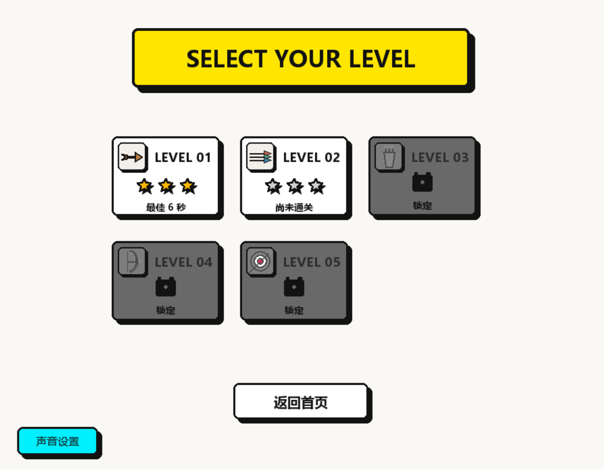

# 一箭又一箭

一款使用 **Python + Pygame** 开发的点击式箭头解谜小游戏。玩家需要观察棋盘中箭头的方向和相互阻挡关系，按照合适的顺序点击箭头，使所有箭头依次飞出棋盘。

本项目在完成基础点箭头玩法的基础上，还加入了关卡选择、随机挑战、提示、AI 自动求解、计时与星级评价、游戏进度保存、动画音效以及 Windows 可执行文件打包等功能。

## 游戏截图

### 关卡选择



更多运行截图和演示内容见博客文章。

## 游戏规则

- 棋盘中包含上、下、左、右四种方向的箭头。
- 使用鼠标点击箭头后，程序会检查箭头指向的同一行或同一列。
- 如果箭头与棋盘边界之间没有其他箭头，它会播放飞出动画并从棋盘中消失。
- 如果前方存在其他箭头，当前箭头会变红并震动，同时扣除一次失误机会。
- 每个关卡有 3 次失误机会，失误次数耗尽后挑战失败。
- 清除当前关卡的全部箭头即可通关，并解锁下一关。
- 游戏支持重新开始，重置后箭头布局、失误次数和计时都会恢复初始状态。

## 主要功能

- **5 个主线关卡**：棋盘规模和箭头数量逐步增加，每关均包含四种方向。
- **关卡选择**：显示关卡解锁状态、最高星级和最佳通关时间。
- **随机挑战**：从 `6×6 / 12 支箭头`、`7×7 / 16 支箭头`、`8×8 / 20 支箭头`三种规格中随机选择并生成关卡。
- **可通关验证**：随机关卡生成后会检查阻挡数量，并通过自动求解验证其能够正常通关。
- **提示功能**：高亮当前可以安全飞出棋盘的箭头。
- **AI 自动求解**：按照实时路径检测结果逐步完成当前关卡。
- **计时与暂停**：进入关卡后开始计时，暂停游戏时计时同步停止。
- **星级评价**：根据玩家通关时间与 AI 参考时间评定一至三星。
- **进度保存**：保存主线关卡的未完成对局、解锁状态、最高星级和最佳时间。
- **动画与音效**：包含箭头飞出、碰撞震动、通关和失败反馈，并支持分别控制背景音乐与飞出音效。

## 游戏模式

### 主线关卡

主线模式包含 5 个固定关卡，箭头数量依次为 8、12、16、20 和 24。每一关的棋盘大小、箭头位置和方向均预先设计，并提供经过验证的通关顺序。第一关默认开放，通关当前关卡后解锁下一关。

### 随机挑战

每次进入随机挑战时，程序会从三种棋盘规格中随机选择一种，并随机安排箭头的位置和方向。生成结果必须包含四种方向，初始状态下至少约三分之一的箭头受到阻挡，并且能够通过程序的求解验证。随机挑战不保存对局进度，再次进入时会生成新的关卡。

## 进度保存规则

游戏使用本地 JSON 文件保存主线进度：

- `savegame.json`：保存尚未完成的主线对局。
- `level_progress.json`：保存各关卡的通关状态、最高星级和最佳时间。

当玩家未通关便返回首页时，程序会保存当前关卡、剩余箭头、剩余失误次数、操作步数和已用时间，之后可以通过“继续关卡”恢复。通关后返回首页时，程序会记录本关成绩，并将下一关的初始状态作为新的继续进度。通关第五关后不再生成下一关存档。

上述 JSON 文件会在首次保存时自动生成，无须手动创建。如果需要清空全部本地进度，可以关闭游戏后删除这两个文件。

## 开发环境

- Python 3.12
- Pygame 2.6.1
- Windows 10/11
- Visual Studio Code

项目依赖记录在 `requirements.txt` 中：

```text
pygame>=2.6,<3
pytest>=8,<10
```

## 安装与运行

### 方式一：通过 Python 运行

1. 克隆项目并进入项目目录：

```bash
git clone https://github.com/zwoyyzy/one-arrow-game.git
cd one-arrow-game
```

2. 安装依赖：

```bash
python -m pip install -r requirements.txt
```

3. 启动游戏：

```bash
python main.py
```

### 方式二：运行 Windows 可执行版

可执行版本发布在 GitHub [Releases](https://github.com/zwoyyzy/one-arrow-game/releases/tag/v1.0.0) 页面。下载该页面中的 Windows ZIP 文件后解压，保留其中的完整文件夹结构，然后双击 `OneArrowGame.exe`。可执行版适用于 Windows 10/11 64 位系统，不需要另外安装 Python 或 Pygame。

游戏进度会写入 `OneArrowGame.exe` 所在目录，因此建议将整个游戏文件夹放在桌面或文档等具有写入权限的位置。

## 运行测试

在项目根目录执行：

```bash
python -m pytest -v
```

自动化测试代码位于 `tests/test_game.py`。界面布局、动画观感和声音效果仍需要人工试玩验证。

## 操作说明

| 操作 | 说明 |
| --- | --- |
| 鼠标左键 | 点击箭头或界面按钮 |
| 提示 | 高亮一个当前可以安全飞出的箭头 |
| AI 自动求解 | 开始或停止自动求解当前关卡 |
| 重置 | 重新开始当前关卡 |
| 暂停 / 继续游戏 | 暂停或恢复游戏与计时 |
| `R` 键 | 游戏中快速重新开始当前关卡 |
| `P` 键 | 暂停或继续游戏 |
| `Esc` 键 | 返回首页；在首页按下时退出游戏 |

## 项目结构

```text
one-arrow-game/
├─ main.py                 # 程序入口与 Pygame 初始化
├─ game.py                 # 游戏状态、事件、计时和关卡流程
├─ arrow.py                # 箭头对象与路径检测
├─ levels.py               # 5 个固定主线关卡
├─ random_levels.py        # 随机关卡生成与可通关验证
├─ ui.py                   # 页面、棋盘、按钮和动画绘制
├─ audio.py                # 背景音乐与游戏音效
├─ save_manager.py         # JSON 存档和成绩管理
├─ requirements.txt        # Python 依赖
├─ release_instructions.txt# Windows 可执行版说明
└─ docs/
   ├─ design.md            # 需求分析与设计记录
   └─ images/              # README 游戏截图
```

## 核心实现

箭头使用 `(row, col, direction)` 表示。程序根据方向取得行列变化量，从箭头前方的第一个格子开始逐格检查，直到到达棋盘边界。如果途中发现其他未飞出的箭头，则判断为受阻；如果没有发现，则允许箭头飞出。

随机挑战会先生成位置与方向，再使用相同的路径检测规则反复寻找可安全移除的箭头。只有能够清除全部箭头的布局才会交给玩家，从而避免出现无法通关的随机题目。

## AIGC 使用说明

本项目在开发过程中使用 ChatGPT / Codex 辅助完成需求分析、代码结构设计、Pygame 界面实现、路径检测、关卡设计、错误排查、扩展功能和文档整理。AI 生成或建议的内容均经过实际运行、人工调整和试玩验证，最终代码及运行结果由项目提交者负责。

## 说明

- 本项目仅参考“一箭又一箭”类型游戏的核心规则。
- 项目未使用原商业游戏的代码、美术素材、音效或关卡。
- 界面图形和箭头由 Pygame 几何绘制完成，音效由程序生成。
- 本项目用于 Python 与 AIGC 辅助软件开发课程实践。
